# Dead Code Analysis Architecture

This document describes the architecture of the reanalyze dead code analysis pipeline.

## Overview

The DCE (Dead Code Elimination) analysis is structured as a **pure pipeline** with four phases:

1. **MAP** - Process each `.cmt` file independently → per-file data
2. **MERGE** - Combine all per-file data → immutable project-wide view
3. **SOLVE** - Compute dead/live status → immutable result with issues
4. **REPORT** - Output issues (side effects only here)

This design enables:
- **Order independence** - Processing files in any order gives identical results
- **Incremental updates** - Replace one file's data without reprocessing others
- **Testability** - Each phase is independently testable with pure functions
- **Parallelization potential** - Phases 1-3 work on immutable data

---

## Pipeline Diagram

> **Source**: [`diagrams/batch-pipeline.mmd`](diagrams/batch-pipeline.mmd)



---

## Key Data Types

| Type | Purpose | Mutability |
|------|---------|------------|
| `DceFileProcessing.file_data` | Per-file collected data | Builders (mutable during AST walk) |
| `FileAnnotations.t` | Source annotations (`@dead`, `@live`) | Immutable after merge |
| `Declarations.t` | All exported declarations (pos → Decl.t) | Immutable after merge |
| `References.t` | Value/type references (source → targets) | Immutable after merge |
| `FileDeps.t` | Cross-file dependencies (file → FileSet.t) | Immutable after merge |
| `OptionalArgsState.t` | Computed optional arg state per-decl | Immutable |
| `AnalysisResult.t` | Solver output with Issue.t list | Immutable |
| `DceConfig.t` | Analysis configuration | Immutable (passed explicitly) |

---

## Phase Details

### Phase 1: MAP (Per-File Processing)

**Entry point**: `DceFileProcessing.process_cmt_file`

**Input**: `.cmt` file path + `DceConfig.t`

**Output**: `file_data` containing builders for:
- `annotations` - `@dead`, `@live` annotations from source
- `decls` - Exported value/type/exception declarations
- `refs` - References to other declarations
- `file_deps` - Which files this file depends on
- `cross_file` - Items needing cross-file resolution (optional args, exceptions)

**Key property**: Local mutable state is OK here (performance). Each file is processed independently.

### Phase 2: MERGE (Combine Builders)

**Entry point**: `Reanalyze.runAnalysis` (merge section)

**Input**: `file_data list`

**Output**: Immutable project-wide data structures

**Operations**:
```ocaml
let annotations = FileAnnotations.merge_all (file_data_list |> List.map (fun fd -> fd.annotations))
let decls = Declarations.merge_all (file_data_list |> List.map (fun fd -> fd.decls))
let refs = References.merge_all (file_data_list |> List.map (fun fd -> fd.refs))
let file_deps = FileDeps.merge_all (file_data_list |> List.map (fun fd -> fd.file_deps))
```

**Key property**: Merge operations are commutative - order of `file_data_list` doesn't matter.

### Phase 3: SOLVE (Deadness Computation)

**Entry point**: `DeadCommon.solveDead` + optional args second pass in `Reanalyze.runAnalysis`

**Input**: All merged data + config

**Output**: `AnalysisResult.t` containing `Issue.t list`

**Algorithm** (forward fixpoint + liveness-aware optional args):

**Core liveness computation** (`Liveness.compute_forward`):
1. Identify roots: declarations with `@live`/`@genType` annotations or referenced from outside any declaration
2. Build index mapping each declaration to its outgoing references (refs_from direction)
3. Run forward fixpoint: propagate liveness from roots through references
4. Return set of all live positions

**Pass 1: Deadness resolution**
1. Compute liveness via forward propagation
2. For each declaration, check if in live set
3. Mark dead declarations, collect issues

**Pass 2: Liveness-aware optional args analysis**
1. Use `Decl.isLive` to build an `is_live` predicate from Pass 1 results
2. Compute optional args state via `CrossFileItems.compute_optional_args_state`, filtering out calls from dead code
3. Collect optional args issues only for live declarations
4. Merge optional args issues into the final result

This two-pass approach ensures that optional argument warnings (e.g., "argument X is never used") only consider calls from live code, preventing false positives when a function is only called from dead code.

**Key property**: Pure functions - immutable in, immutable out. No side effects.

### Phase 4: REPORT (Output)

**Entry point**: `Reanalyze.runAnalysis` (report section)

**Input**: `AnalysisResult.t`

**Output**: Logging / JSON to stdout

**Operations**:
```ocaml
AnalysisResult.get_issues analysis_result
|> List.iter (fun issue -> Log_.warning ~loc:issue.loc issue.description)
```

**Key property**: All side effects live here at the edge. The solver never logs directly.

---

## Incremental Updates (Future)

The architecture enables incremental updates when a file changes:

1. Re-run Phase 1 for changed file only → new `file_data`
2. Replace in `file_data` map (keyed by filename)
3. Re-run Phase 2 (merge) - fast, pure function
4. Re-run Phase 3 (solve) - fast, pure function

The key insight: **immutable data structures enable safe incremental updates** - you can swap one file's data without affecting others.

---

## Reactive Pipelines

The reactive layer (`analysis/reactive/`) provides delta-based incremental updates. Instead of re-running entire phases, changes propagate automatically through derived collections.

### Core Reactive Primitives

| Primitive | Description |
|-----------|-------------|
| `Reactive.t ('k, 'v)` | Universal reactive collection interface |
| `subscribe` | Register for delta notifications |
| `iter` | Iterate current entries |
| `get` | Lookup by key |
| `delta` | Change notification: `Set (k, v)`, `Remove k`, or `Batch [(k, v option); ...]` |
| `source` | Create a mutable source collection with emit function |
| `flatMap` | Transform collection, optionally merge same-key values |
| `join` | Hash join two collections (left join behavior) |
| `union` | Combine two collections, optionally merge same-key values |
| `fixpoint` | Transitive closure: `init + edges → reachable` |
| `ReactiveFileCollection` | File-backed collection with change detection |

### Glitch-Free Semantics via Topological Scheduling

The reactive system implements **glitch-free propagation** using an accumulate-then-propagate scheduler. This ensures derived collections always see consistent parent states, similar to SKStore's approach.

**How it works:**
1. Each node has a `level` (topological order):
   - Source collections have `level = 0`
   - Derived collections have `level = max(parent levels) + 1`
2. Each combinator **accumulates** incoming deltas in pending buffers
3. The scheduler visits dirty nodes in level order and calls `process()`
4. Each node processes **once per wave** with complete input from all parents

**Example ordering:**
```
file_collection (L0) → file_data (L1) → decls (L2) → live (L14) → dead_decls (L15)
```

When a batch of file changes arrives:
1. Deltas accumulate in pending buffers (no immediate processing)
2. Scheduler processes level 0, then level 1, etc.
3. A join processes only after **both** parents have updated

The `Reactive.Registry` and `Reactive.Scheduler` modules provide:
- Named nodes with stats tracking (use `-timing` flag to see stats)
- `to_mermaid()` - Generate pipeline diagram (use `-mermaid` flag)
- `print_stats()` - Show per-node timing and delta counts

### Fully Reactive Analysis Pipeline

The reactive pipeline computes issues directly from source files with **zero recomputation on cache hits**:

```
Files → file_data → decls, annotations, refs → live (fixpoint) → dead/live_decls → issues → REPORT
         ↓              ↓                          ↓                    ↓              ↓        ↓
     ReactiveFile   ReactiveMerge          ReactiveLiveness      ReactiveSolver            iter
     Collection         (flatMap)              (fixpoint)      (multiple joins)          (only)
```

**Key property**: When no files change, no computation happens. All reactive collections are stable. Only the final `collect_issues` call iterates pre-computed collections (O(issues)).

### Pipeline Stages

| Stage | Input | Output | Combinator |
|-------|-------|--------|------------|
| **File Processing** | `.cmt` files | `file_data` | `ReactiveFileCollection` |
| **Merge** | `file_data` | `decls`, `annotations`, `refs` | `flatMap` |
| **Liveness** | `refs`, `annotations` | `live` (positions) | `fixpoint` |
| **Dead/Live Partition** | `decls`, `live` | `dead_decls`, `live_decls` | `join` (partition by liveness) |
| **Dead Modules** | `dead_decls`, `live_decls` | `dead_modules` | `flatMap` + `join` (anti-join) |
| **Per-File Grouping** | `dead_decls`, `refs` | `dead_decls_by_file`, `refs_by_file` | `flatMap` with merge |
| **Per-File Issues** | `dead_decls_by_file`, `annotations` | `issues_by_file` | `flatMap` (sort + filter + generate) |
| **Incorrect @dead** | `live_decls`, `annotations` | `incorrect_dead_decls` | `join` (live with Dead annotation) |
| **Module Issues** | `dead_modules`, `issues_by_file` | `dead_module_issues` | `flatMap` + `join` |
| **Report** | all issue collections | stdout | `iter` (ONLY iteration) |

### ReactiveSolver Collections

| Collection | Type | Description |
|------------|------|-------------|
| `dead_decls` | `(pos, Decl.t)` | Declarations NOT in live set |
| `live_decls` | `(pos, Decl.t)` | Declarations IN live set |
| `dead_modules` | `(Name.t, Location.t)` | Modules with only dead declarations (anti-join) |
| `dead_decls_by_file` | `(file, Decl.t list)` | Dead decls grouped by file |
| `value_refs_from_by_file` | `(file, (pos, PosSet.t) list)` | Refs grouped by source file (for hasRefBelow) |
| `issues_by_file` | `(file, Issue.t list * Name.t list)` | Per-file issues + reported modules |
| `incorrect_dead_decls` | `(pos, Decl.t)` | Live decls with @dead annotation |
| `dead_module_issues` | `(Name.t, Issue.t)` | Module issues (join of dead_modules + modules_with_reported) |

**Note**: Optional args analysis (unused/redundant arguments) is not yet in the reactive pipeline - it still uses the non-reactive path (~8-14ms). TODO: Add `live_decls + cross_file_items → optional_args_issues` to the reactive pipeline.

### Reactive Pipeline Diagram

> **Source**: [`diagrams/reactive-pipeline.mmd`](diagrams/reactive-pipeline.mmd)



This is a high-level view (~25 nodes). See also the [full detailed diagram source](diagrams/reactive-pipeline-full.mmd) with all 44 nodes (auto-generated via `-mermaid` flag).

Key stages:

1. **File Layer**: `file_collection` → `file_data` → extracted collections
2. **TypeDeps**: `decl_by_path` → interface/implementation refs → `all_type_refs`
3. **ExceptionRefs**: `cross_file` → `resolved_refs` → `resolved_from`
4. **DeclRefs**: Combines value/type refs → `combined` edges
5. **Liveness**: `annotated_roots` + `externally_referenced` → `all_roots` + `edges` → `live` (fixpoint)
6. **Solver**: `decls` + `live` → `dead_decls`/`live_decls` → per-file issues → module issues

Use `-mermaid` flag to generate the current pipeline diagram from code.

### Delta Propagation

When a file changes:

1. `ReactiveFileCollection` detects change, emits delta for `file_data`
2. `ReactiveMerge` receives delta, updates `decls`, `refs`, `annotations`
3. `ReactiveLiveness` receives delta, updates `live` set via incremental fixpoint
4. `ReactiveSolver` receives delta, updates `dead_decls` and `issues` via reactive joins
5. **Only affected entries are recomputed** - untouched entries remain stable

When no files change:
- **Zero computation** - all reactive collections are stable
- Only `collect_issues` iterates (O(issues)) - this is the ONLY iteration in the entire pipeline
- Reporting is linear in the number of issues

### Performance Characteristics

| Scenario | Solving | Reporting | Total |
|----------|---------|-----------|-------|
| Cold start (4900 files) | ~2ms | ~3ms | ~7.7s |
| Cache hit (0 files changed) | ~1-5ms | ~3-8ms | ~30ms |
| Single file change | O(affected_decls) | O(issues) | minimal |

**Key insight**: On cache hit, `Solving` time is just iterating the reactive `issues` collection.
No joins are recomputed, no fixpoints are re-run - the reactive collections are stable.

### Reactive Modules

| Module | Responsibility |
|--------|---------------|
| `Reactive` | Core primitives: `source`, `flatMap`, `join`, `union`, `fixpoint`, `Scheduler`, `Registry` |
| `ReactiveFileCollection` | File-backed collection with change detection |
| `ReactiveAnalysis` | CMT processing with file caching |
| `ReactiveMerge` | Derives decls, annotations, refs from file_data |
| `ReactiveTypeDeps` | Type-label dependency resolution |
| `ReactiveExceptionRefs` | Exception ref resolution via join |
| `ReactiveDeclRefs` | Maps declarations to their outgoing references |
| `ReactiveLiveness` | Computes live positions via reactive fixpoint |
| `ReactiveSolver` | Computes dead_decls and issues via reactive joins |

### Stats Tracking

Use `-timing` flag to see per-node statistics:

| Stat | Description |
|------|-------------|
| `d_recv` | Deltas received (Set/Remove/Batch messages) |
| `e_recv` | Entries received (after batch expansion) |
| `+in` / `-in` | Adds/removes received from upstream |
| `d_emit` | Deltas emitted downstream |
| `e_emit` | Entries in emitted deltas |
| `+out` / `-out` | Adds/removes emitted (non-zero `-out` indicates churn) |
| `runs` | Times the node's `process()` was called |
| `time_ms` | Cumulative processing time |

---

## Testing

**Order-independence test**: Run with `-test-shuffle` flag to randomize file processing order. The test (`make test-reanalyze-order-independence`) verifies that shuffled runs produce identical output.

**Unit testing**: Each phase can be tested independently:
- Phase 1: Process a single `.cmt` file, verify `file_data`
- Phase 2: Merge known builders, verify merged result
- Phase 3: Call solver with known inputs, verify issues

---

## Key Modules

| Module | Responsibility |
|--------|---------------|
| `Reanalyze` | Entry point, orchestrates pipeline |
| `DceFileProcessing` | Phase 1: Per-file AST processing |
| `DceConfig` | Configuration (CLI flags + run config) |
| `DeadCommon` | Phase 3: Solver (`solveDead`, `solveDeadReactive`) |
| `Liveness` | Forward fixpoint liveness computation |
| `Declarations` | Declaration storage (builder/immutable) |
| `References` | Reference tracking (source → targets) |
| `FileAnnotations` | Source annotation tracking |
| `FileDeps` | Cross-file dependency graph |
| `CrossFileItems` | Cross-file optional args and exceptions |
| `AnalysisResult` | Immutable solver output |
| `Issue` | Issue type definitions |
| `Log_` | Phase 4: Logging output |
| `ReactiveSolver` | Reactive dead_decls → issues computation |

